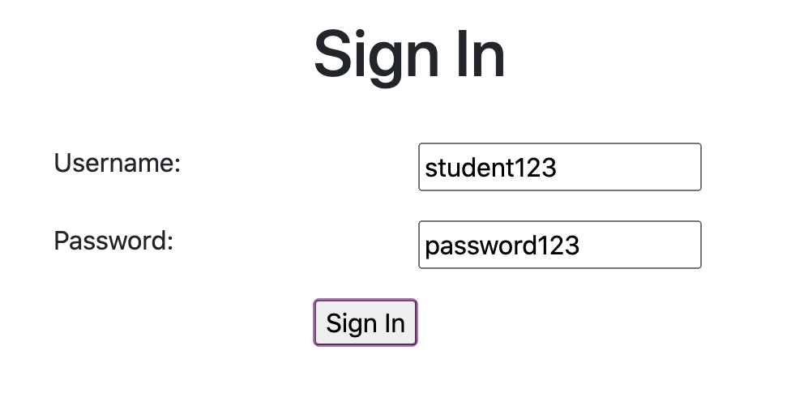
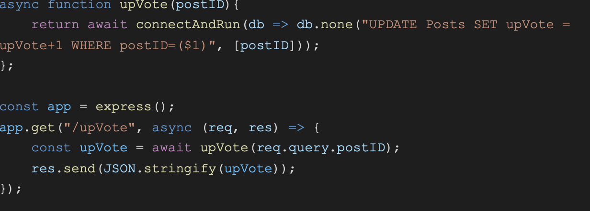
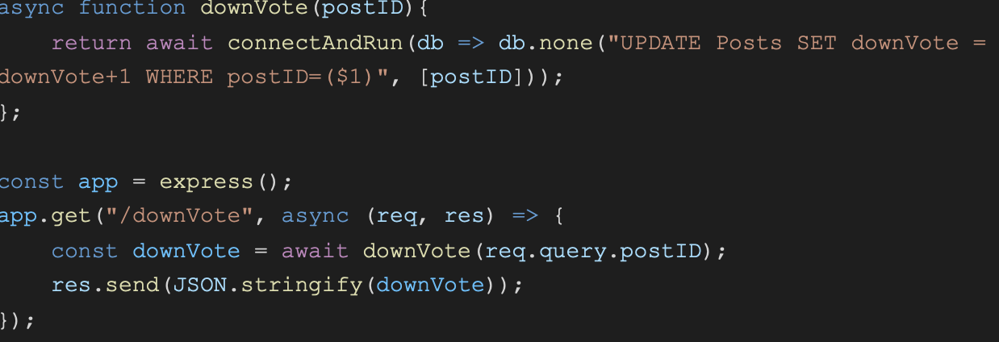

# Milestone 2: Front-end Javascript

## Team Name: zayin

## Application Name: FairShare

## Team Overview:
Members: Anthony Woo, Atmaja Shah, Shivani Patel GitHub 
Usernames: anthonytwoo, atmajashah, shipatel

## Part 0: Project API Planning:

- USER: (/user)
    - Sign up (/user/signup)
        - Create new unique username and password
    - Sign in (/user/login)
        - Username will be a unique identifier to identify each user that logged in
        - It is used to identify the author of posts

- Company List: (/company-list)
    - Shows list of companies that participated in career fairs
    - Can be filtered by types or locations, etc.
    - Unique ID in the back-end to identify each company for search and filter

- Career Fair List: (/career-fair-list)
    - Shows list of career fairs in the past / upcoming
    - Can be filtered by types or locations, etc.
    - Unique ID in the back-end to identify each career fair for search and filter

- Search:  (/search)
    - Search bar that searches related posts using the text from user input

- Post:
    - Contain information such as company, school, comments, rating, and more
    - Create Post (/post/create)
        - Users are able to create post with information such as company, school, and comment on their experience
        - When a post is created it will have a unique ID in the database for back-end functions
    - Delete Post (/post/delete)
        - Users are able to delete posts that are created by them, identified by username stored in a specific post
    - Upvote/ Downvote
        - Users are able to upvote or downvote the post with a counter of how many upvotes and downvotes there are for each post

- Calendar:
    - For filtering purpose on list of career fairs
    - Users can select date on calendar to filter list of career fairs

- Postgres Database:
    - Users
        - Username (PRIMARY KEY)
        - Password

        

    - Posts
        - Post ID (PRIMARY KEY)
        - Username 
        - CompanyID (FOREIGN KEY)
        - Company Name
        - Post (about the company)
        - Post rating
        - Company Location
        - Company Type
        - Up Vote
        - Down Vote
        - School

        

    - List of Companies
        - Company ID (PRIMARY KEY)
        - Company Name
        - Company Location
        - Company Type
        - CareerFairID (FOREIGN KEY)

        

    - List of Career Fairs
        - Career Fair ID (PRIMARY KEY)
        - Career Fair Name
        - School
        - Date
        - Type of Career Fair

        

## Part 1 & 2 Back-end Skeleton Code & Front-end Implementation: 
- Create:
    - Add Post: 
        
        
    - For our create operation, we implemented a create post function for our website. This takes in the username, company ID, company name, company location, company type, school, comment, and rating. It also automatically sets the upVote and downVote values to zero and auto generates a postID. We also implemented a sign up (or create account function) that takes in a username, password, and school. This allows users to make an account so that they can engage with the website. The console shows that the data was successfully sent over to the server to with the specific endpoint.

- Read:
    - Past Career Fairs: 
        
    - The above screenshot is a simple example showing how we can read data from our database. The url (/cf) returns the list of career fairs in our database, and for now we only returned it as a JSON object to showcase the function. It will be implemented into the table of career fairs later on in (/career-fair-list).

    - Sign in: 
        
        
    - Another example of reading data is portrayed by this image of a user signing into their account, and this is being read and sent to the server, which is shown by the console under it.

- Update:
    - UpVote:
        
    - DownVote:
        
    - For our update operation, we implemented upVote and downVote features that allow a user to indicate whether or not they found a post helpful. The vote count for each updates when either the upVote or downVote buttons are clicked. We are still working on having an undo option where the user clicks on either upVote or downVote and can undo it by clicking it again. Also, we are trying to find a way to keep a user from selecting both upVote and downVote and expect to have that implemented for the next milestone.

    - Filter Career Fair Table: 
        
    - When a user selects filters and clicks apply, our application will filter the table using PostgreSQL and return the filtered list. Screenshot above shows that it returns the filters selected by the user, and we will implement the back-end code to filter and display the actual table later on.

- Delete
    - Delete Post
        
    - For our delete operation, we created a delete post option that removes that particular post from the database. We plan on adding to it so only the user who created a post will be able to delete a post and expect to have that implemented for the next milestone. As of right now, any post that exists can be deleted by any user and will be removed from the database.

## Division of labor:
#### Anthony Woo: 
- Created Heroku App and Database
- Filter function on Career Fair List and Company List
- Read past career fairs from database
- Search text filter
- Documentation

#### Atmaja Shah:
- Front End Implementation on Server & Client Side for Create Post
- Front End Implementation on Server & Client Side for Sign Up
- Front End Implementation on Server & Client Side for Sign In 

#### Shivani Patel:
